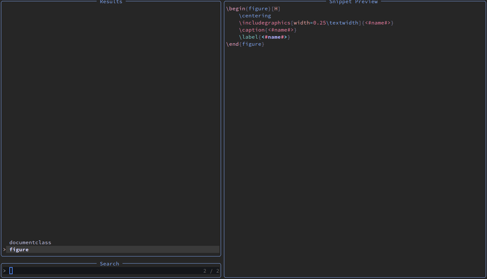

# Snippet Plugin for Neovim

[[_TOC_]]

## About the Project
This project is part of the module "fprod" at the FHNW in Burgg/Windisch.
The plugin makes it possible to easily save text or code snippets and to plot 
them at a given place if needed. 
For this purpose, a simple snippet management is provided, 
which offers the possibility to select among the available snippets using [Telescope](https://github.com/nvim-telescope/telescope.nvim)
The snippets are persisted in an external file.



## Getting started

### Prerequisites

Make sure that both [neovim](https://neovim.io/) and the plugin [telescope.nvim](https://github.com/nvim-telescope/telescope.nvim#installation) are installed.
Just follow the installation sections of them.

### Installation

Install the Neovim API for Haskell [nvim-hs](https://github.com/neovimhaskell/nvim-hs) using your favorite nvim plugin manager. (e.g. [vim-plug](https://github.com/junegunn/vim-plug))

```vimL
Plug 'neovimhaskell/nvim-hs.vim'
```

## Usage
### Setup
1. Clone this Git Repository
2. Create a file that is loaded by neovim on startup and add the following content:
```lua
vim.cmd( [[ 
  call nvimhs#start('PATH/TO/THE/REPO', 'snips', []) 
]])
```
3. Run `stack build` in your repository's folder
4. Test the installation: run `:echo SnipsVersion()`, this should print a message to the status line.

### Creating a snippet
1. Open a file in Neovim and select the code lines you want to save as snippet.
2. Switch to Neovims command mode by typing `:` and type `SnipsCreate` just after `:'<,'>`.
3. In the newly opened buffer, replace words that you want to use as placeholders by a string that is quoted by `<#` / `#>`
    _Note_: if you use the same quoted string multiple times, snips-nvim will use the same text replacements when you use the snippet.
4. Switch to Neovims command mode by typing `:` and type `SnipsSave` just after `:`.
5. Enter a name for the new snippet

The snippet will now be saved and it is possible to retrieve it at any time.

### Finding a snippet
If you created a snippet, you can retrieve it at any time.
1. Open any file in Neovim
2. Switch to Neovims command mode by typing `:` and type `Snips` just after `:`.
3. Telescope opens and you are able to fuzzy find your desired snippet by typing the snippets name
4. Choose a Snippet to insert by hitting Enter
5. Snips-nvim asks you now to add the placeholder replacement texts. (Placeholders with the same names, will get the same values.)

The snippet is now pasted to your previous opened buffer.

_Note:_ snips-nvim stores and retrieves snippets per filetype. Therefore telescope only shows you the snippets matching the filetype of your currently opened buffer. 
You can set the filetype of a file manually using `:set filetype=haskell`

## Acknowledgments
* [Haskell plugin API for neovim](https://hackage.haskell.org/package/nvim-hs)
* [nvim-hs.vim](https://github.com/neovimhaskell/nvim-hs.vim)

## Development
- for LSP to work use and install hls version 1.10.0.0 using ghcup

### Debugging
1. export the function in the module definition
2. start cabal using `cabal repl`
3. execute the function (e.g. for a function `hello` in the module `Plugin.FprodTeam` just run `Plugin.FprodTeam.hello`)
Tip: See also: [Debug in nvim-hs](https://hackage.haskell.org/package/nvim-hs-0.2.4/docs/Neovim-Debug.html#v:debug)

### Recompile the plugin in Neovim
add a keybinding to your nvim config:
  nvim: 
  ```lua
vim.keymap.set("n", "<F5>",
  function()
    vim.cmd([[ call nvimhs#compileAndRestart('snips') ]])
    print("recompiled")
  end
)
```

## Testing
To run all tests, follow the steps below.

Start cabal in the test folder:
```sh
cabal v2-repl tests
```
Execute the `main` function:
```sh
ghci> main
```

## Links
* [Nvim-hs API documentation](https://hackage.haskell.org/package/nvim-hs-2.1.0.4)
* [List of functions that are provided by nvim-hs](https://hackage.haskell.org/package/nvim-hs-2.1.0.4/docs/Neovim-API-Text.html#v:vim_command_output)
* [Proof of Concept for the JSON parsing (as on Raphaels Laptop, the Snippet first didn't run)](https://github.com/raphaelluethy/haskell-json)
* [Github Issue for M1 with nvim-hs](https://github.com/neovimhaskell/nvim-hs/issues/114#issuecomment-1555978729)


## Contact
- Tobias Wyss - tobias.wyss@students.fhw.ch
- Raphael Lüthy - raphael.luethy@students.fhnw.ch
- Andri Wild - andri.wild@students.fhnw.ch 

# Notes to the lecturers
Since the nvim-hs package is very badly documented, we lost a lot of time (and nerves) to get the plugin up and running and to interact with neovim. Please consider this in the evaluation :).
Nothing more to say right now, but it was fun to experience Haskell in this way and to create something we can use every day. Maybe we will release the plugin later in the summer on GitHub.
